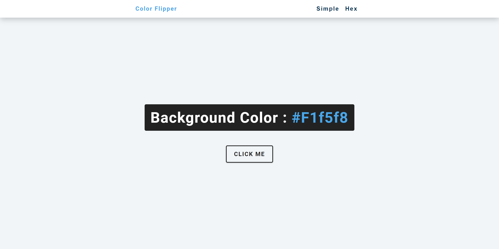

# JS-Color-Flipper

This is a solution to the [JS color flipper challenge on Sidehustle Internship](https://internship.sidehustle.ng/). 
The javascript was tweaked a little so that the flipper can generate colors infinately.
## Table of contents

- [Overview](#overview)
  - [The challenge](#the-challenge)
  - [Screenshot](#screenshot)
  - [Links](#links)
- [My process](#my-process)
  - [Built with](#built-with)
  - [What I learned](#what-i-learned)
  - [Continued development](#continued-development)
  - [Useful resources](#useful-resources)
- [Author](#author)
- [Acknowledgments](#acknowledgments)

## Overview

### Screenshot

### Links

- Solution URL: [My solution](https://github.com/kindnessrho/JS-Color-Flipper)
- Live Site URL: [Live site](https://tributepage-sidehustle.netlify.app/)

## My process

### Built with

- Semantic HTML5 markup
- CSS custom properties
- Flexbox
- Mobile-first workflow
- Javascript

### What I learned

This challenge has helped me to improve and learn new concepts in Javascript.

### Continued development

I want to continue to learn and improve in javascript.

## Author

- Website - [kindnessrho](https://kindnessrho.netlify.app/)
- Twitter - [@kindnessrho](https://twitter.com/kindnessrho?s=09)
